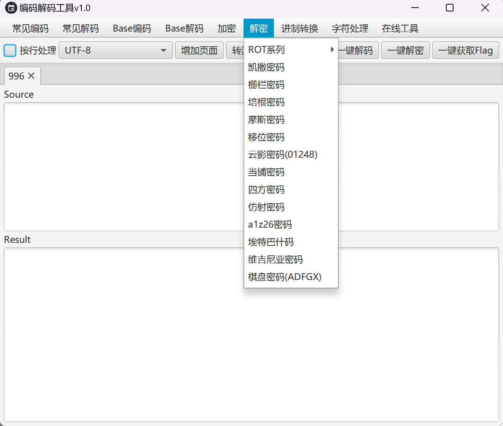

# CTF-Knife

此工具基于[CTF-Tools](https://github.com/qianxiao996/CTF-Tools) 重构

一款CTF编码、解码、加密、解密工具。

##### 支持的编码解码:

- [x] URL

- [x] Unicode

- [x] Escape(%U)

- [x] HtmlEncode

- [x] ACSII(2进制)

- [x] ACSII(8进制)

- [x] ACSII(10进制)

- [x] ACSII(16进制)

- [x] Shellcode

- [x] qwerty(键盘密码)

- [x] Str->Hex

- [x] Quoted-printable

- [x] 图片转base64

- [x] 图片转hex

- [x] JsFuck

- [x] JJEncode

- [x] AAEncode

- [x] UUencode

- [x] XxEncode

- [x] BrainFuck

- [x] Ook

- [x] Ook(Short)

- [x] jother

- [x] 百家姓编码

- [x] 核心价值观编码

##### 支持的base编码

- [x] Base16
- [x] Base32
- [x] Base36
- [x] Base58
- [x] Base62
- [x] Base64
- [x] Base64(自定义)
- [x] Base85
- [x] Base91
- [x] Base92
- [x] Base100

##### 支持的加密解密:

- [x] Rot5
- [x] Rot13
- [x] Rot18
- [x] Rot47
- [x] Rot8000
- [x] 凯撒密码
- [x] 栅栏密码
- [x] 培根密码
- [x] 摩斯密码
- [x] 移位密码
- [x] 云影密码
- [x] 当铺密码
- [x] a1z26密码 
- [x] 埃特巴什码
- [x] 与佛论禅
- [x] 如是我闻
- [x] 与佛论禅2.0
- [x] Sealed-Book(天书)

##### 单Key加密

- [x] 维尼吉亚密码
- [x] 棋盘密码 

##### 多Key加密

- [x] 四方密码
- [x] 仿射密码

##### 现代密码:

- 流密码
  - [x] xor
  - [x] rc4
  - [x] Rabbit
- 对称密码
  - [x] AES
  - [x] DES/3DES
  - [x] SM4
- 非对称密码
  - [x] RSA
  - [x] Sm2
- 哈希算法
  - [x] MD4
  - [x] MD5
  - [x] SM3
- Sha家族
  - [x] Sha1
  - [x] Sha224
  - [x] Sha256
  - [x] Sha384
  - [x] Sha512
  - [x] Sha3-224
  - [x] Sha3-256
  - [x] Sha3-384
  - [x] Sha3-512

- HMAC
  - [x] HMACSha1
  - [x] HMACSha224
  - [x] HMACSha256
  - [x] HMACSha384
  - [x] HMACSha512
  - [x] HMACMD5

#####  HTML工具

  - [x] 零宽隐写
  - [x] CryptoJS AES/DES/3DES/RC4/Rabbit
  - [x] CyberChef

##### 进制转换:

- [x] 2->8
- [x] 2->10
- [x] 2->16
- [x] 8->2
- [x] 8->10
- [x] 8->16
- [x] 10->2
- [x] 10->8
- [x] 10->16
- [x] 16->2
- [x] 16->8
- [x] 16->10
- [x] 任意进制转换

##### 在线编码网站:

- [x] Jsfuck
- [x] AAencode
- [x] XXencode
- [x] JJencode
- [x] UUencode
- [x] Brainfuck/Ook!
- [x] 敲击码
- [x] 猪圈密码
- [x] 综合网站
- [x] Rabbit

......

## 错误

### JDk8 AES-256编码失败问题

#### JDK 1.8.0_151及其之前版本解决办法：

修改策略文件，更改官网提供的jce无限制权限策略文件。

JDK7策略文件下载地址

http://www.oracle.com/technetwork/java/embedded/embedded-se/downloads/jce-7-download-432124.html

文件名：UnlimitedJCEPolicyJDK7.zip

JDK8策略文件下载地址：

http://www.oracle.com/technetwork/java/javase/downloads/jce8-download-2133166.html

 文件名：jce_policy-8.zip

然后把解压出来的文件替换掉jdk目录中的文件即可。文件目录为${java_home}/jre/lib/security/下。

#### **JDK 1.8.0_151及其之后版本解决办法**

从JDK 1.8.0_151版本开始，Java公司为JVM启用无限制强度管辖策略，有了一种新的更简单的方法。如果不启用此功能，则不能使用AES-256，启用起来也非常方便。

在JDK 1.8.0_151中已经没有local_policy.jar以及US_export_policy.jar文件了，但是多了个policy文件夹，在policy文件夹下有两个子文件夹，分别为limitted（有限制）和unlimited（无限制），我们直接启用无限制即可。也就是修改JDK中的java.security文件中的配置即可。

改完重启Java项目后。我们的JDK就支持AES-256位加密算法了。 
